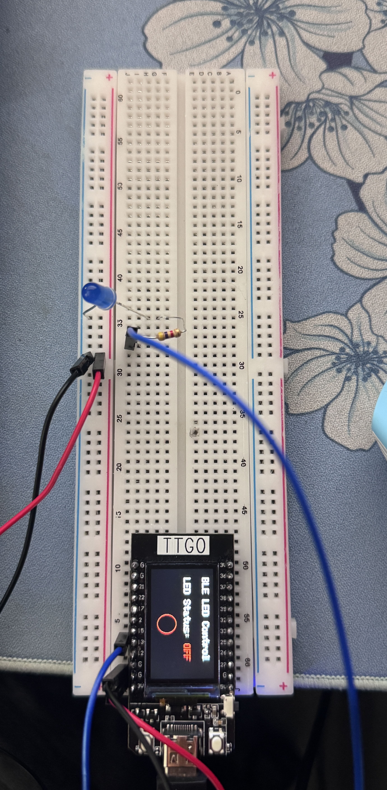

# CS-596-LAB-4
 * Genesis Anne Villar (RED ID: 824435476)
 * Steven Gervacio (RedID: 825656527)
 * CS 596 IOT - Prof. Donyanavard
 * Due Date: 4/16/2025
# Bluetooth Step Counter With ESP32
This project uses an ESP32 TTGO board to demonstrate wireless control and motion sensing. In Part A, a mobile phone sends commands via Wi-Fi or Bluetooth to turn an LED on or off, showcasing basic client-server communication. In Part B, the ESP32 reads motion data from the LSM6DS3 sensor to count steps based on threshold detection. The step count is sent to a phone via BLE, simulating a simple fitness tracker.
# Top Down View of Circuit

# Video Demonstration
* Actual video demo is also in repository

# Start Up Sequence
* System powers on the ESP32 initializes Wi-Fi/Bluetooth stack and waits for connection from mobile phone. LED control system is ready and LED starts in OFF state while it waits for "LED_ON" or "LED_OFF" command from phone to toggle LED state.
* Step counter system starts. LSM6DS3 sensor is calibrated for baseline motion and ESP32 begins reading acceleration data every 20ms.
* Step detection is active if motion exceeds threshold and step count increases. The step count is printed to serial monitor and sent via BLE to phone in real time

#  Bluetooth Step Counter Summary
"LED_ON" Command Received: LED turns on
"LED_OFF" Command Received: LED turns off
Idle State: LED remains in last state until new command is received
Sensor Calibration: Performed at startup to set motion baseline
Step Detection: Active every 20ms using acceleration threshold
Step Output: Count printed to serial monitor and sent via BLE to phone
Continuous Operation: System continuously monitors motion and responds to Bluetooth commands
